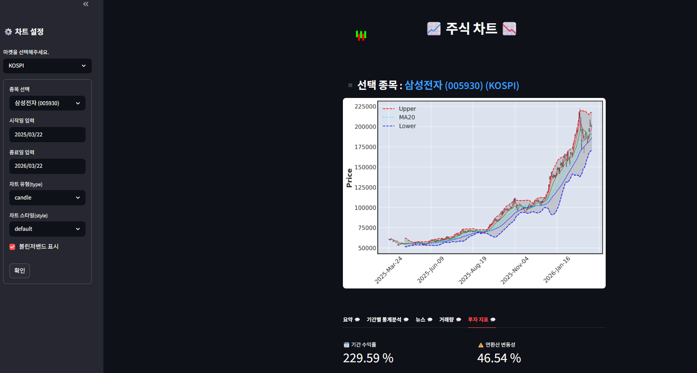
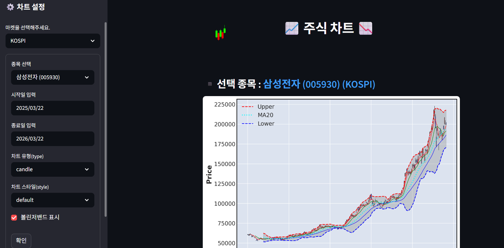
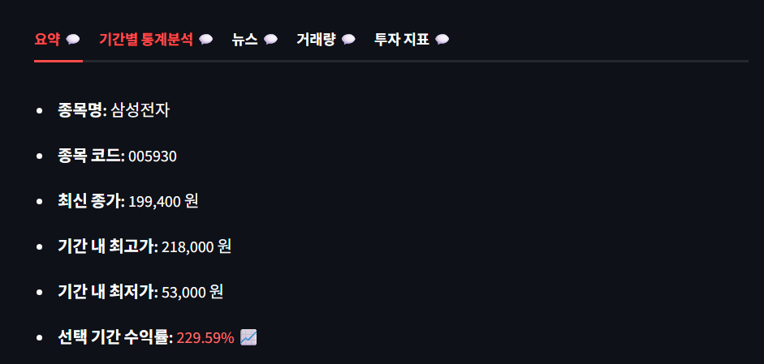
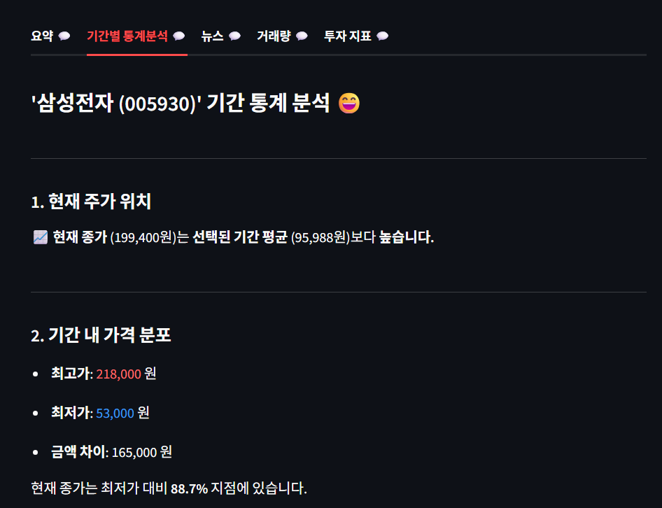
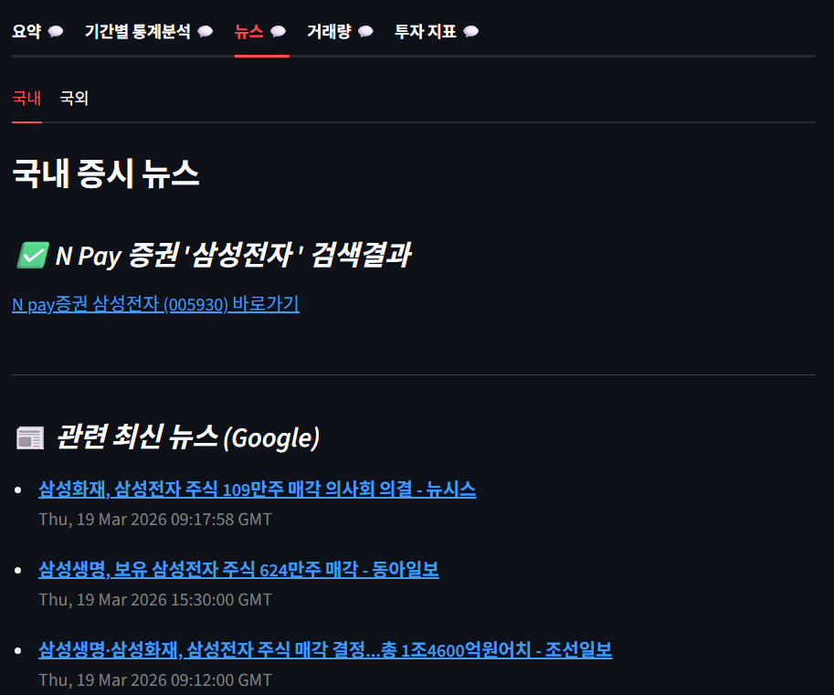
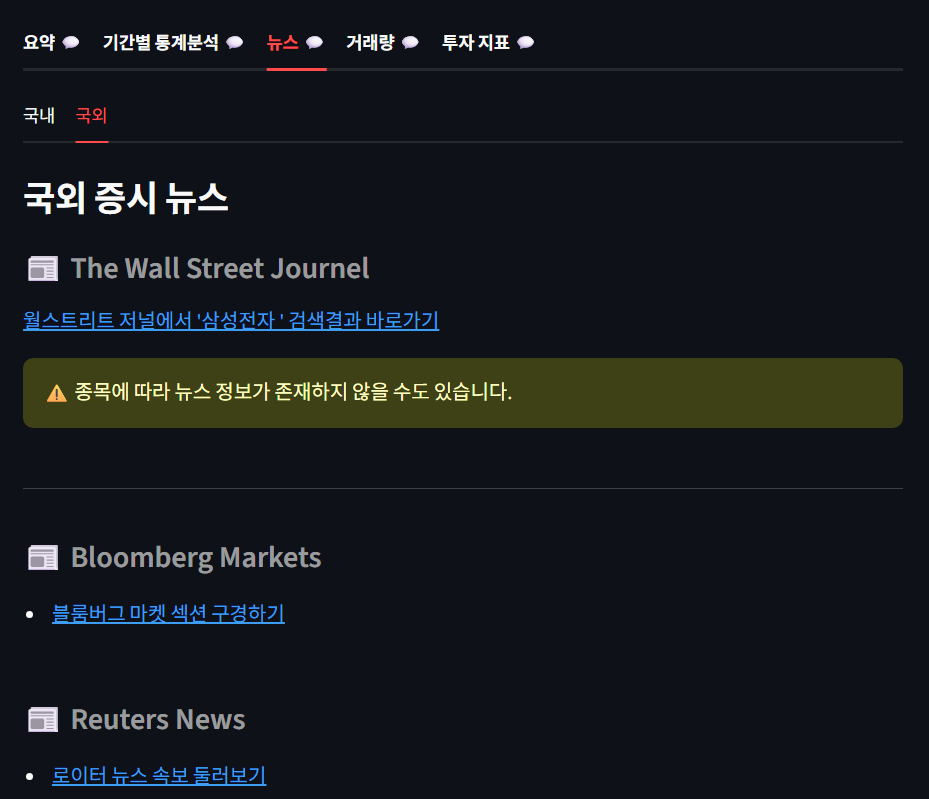
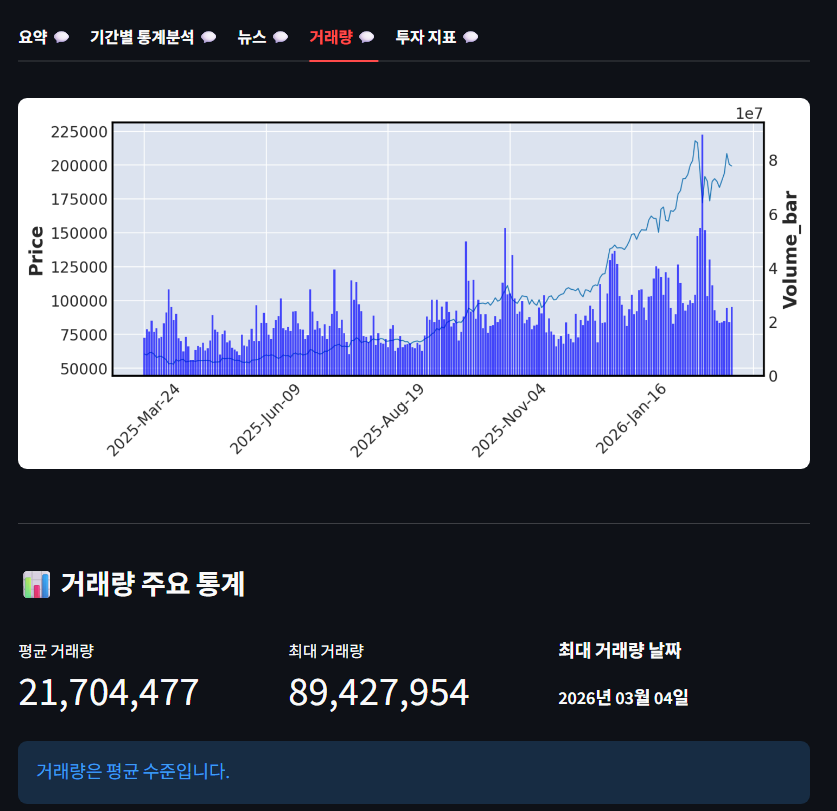
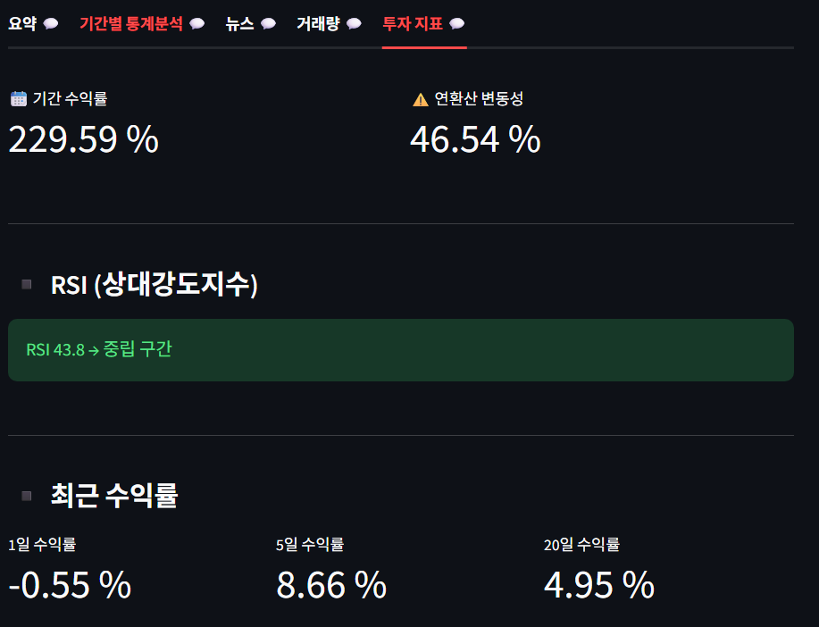

# 주식 차트 분석 서비스 by 상부삼조
<br>

> Streamlit 기반 주식 데이터 시각화 웹 애플리케이션
<br>



---

## 📌 프로젝트 개요

> yfinance, mplfinance 등을 활용해 종목별 주가 차트를 시각화하고, 차트 하단에 탭을 사용하여 투자에 필요한 5가지 지표들을 제공하는 웹 서비스입니다.

- **개발 기간**: 2025.12.11 ~ 2025.12.16
- **팀 구성**: 4명
- **배포 환경**: Streamlit Community Cloud <br>
[배포 링크(바로 보기)](https://lion1project3team.streamlit.app/)
<br>

---

## 🛠 기술 스택

| 분류 | 기술 |
|------|------|
| Language | Python |
| Framework | Streamlit |
| 데이터 | mplfinance, finance-datareader, pandas |
| 시각화 | matplotlib, plotly |
| 배포 | Streamlit Community Cloud |
| 라이브러리 업데이트 자동화 | GitHub Actions |
<br>

---

## 🔸 주요 기능
<br>


- [ ] **왼쪽 사이드바:** 종목, 시작일, 종료일, 차트 유형 및 스타일, 볼린저밴드 여부 선택 후 '확인' 클릭
- [ ] **오른쪽 화면:** 사이드바에서 선택한 종목의 주식 차트 시각화, 하단의 탭 5개로 관련 정보 확인 가능
<br>


- [ ] **탭 1: 요약** - 종목명, 종목 코드, 최신 종가, 기간 내 최고가, 기간 내 최저가, 선택 기간 수익률
<br>


- [ ] **탭 2: 기간별 통계분석** - 현재 주가 위치, 기간 내 가격 분포(최고가, 최저가, 금액 차이, 종가)
<br>



- [ ] **탭 3: 뉴스** - 국내 증시 뉴스, 관련 구글 최신 뉴스, 월스트리트 저널, 블룸버그, 로이터
<br>


- [ ] **탭 4: 거래량** - 거래량 그래프, 평균 거래량, 최대 거래량, 최대 거래량 날짜, 거래량 수준
<br>


- [ ] **탭 5: 투자 지표** - 기간 수익률, 연환산 변동성, RSI, 최근 수익률
<br>

---

## ▪️ 팀원 및 역할

| 이름 | 역할 |
|------|-------------|
| 공통 담당 | 메인 주식 차트 / 사이드바 수정 |
| [김유선](https://github.com/kimyuseon) | 사이드바, 요약 탭, 기간별 통계분석 탭, 로티 |
| [박지영](https://github.com/battlegroundcallofduty) | 구글 뉴스, 국외 뉴스, 거래량 탭, 투자지표 탭, 캐시  |
| [이영진](https://github.com/ilove0628yj-w) | 사이드바 마켓, 국내 증시 뉴스, 볼린저밴드, 범례 |
| [박동제](https://github.com/dongjebag59-dev) | ppt 발표자료 준비, 코드 실행 체크 |

<br>

---

## ▪️ 프로젝트 구조

```
Lion_1_Streamlit/
├── .streamlit/
│   └── config.toml       # Streamlit 설정
├── .github/
│   └── workflows/        
│       └── update-requirements.yml   # 라이브러리 자동 업데이트
├── assets/               # readme 첨부 파일들
│   └── png, pptx ...
├── team3pro.py           # 메인 앱
├── requirements.txt      # 의존성 목록
└── README.md
```
<br>

---

## + 유지보수 참고사항

### 1. Streamlit 앱 절전 모드
Streamlit Community Cloud 무료 플랜은 일정 시간 미접속 시 앱이 잠듦. 접속하면 "앱 깨우기" 버튼이 표시되며, 1~2분 내로 재시작됨.
**항상 켜둬야 하는 시기**에는 아래 방법으로 상시 유지할 예정:
- [UptimeRobot](https://uptimerobot.com) 무료 계정 생성
- HTTP(s) 모니터 추가 → 앱 URL 입력 → Interval: 5분 설정

### 2. 라이브러리 자동 업데이트
`.github/workflows/update-requirements.yml`에 의해 매주 월요일 자동으로 패키지 최신 버전을 확인하고 `requirements.txt`를 갱신함. Streamlit Cloud가 변경을 감지해 앱을 자동 재배포함. <br> + github actions 사용중인데, 무료 플랜 월 사용량에 변동사항이 있다면 업데이트 자동화 변경 예정

<br>

---

## ▪️ 로컬 실행 방법

```bash
# 1. 레포지토리 클론
git clone https://github.com/battlegroundcallofduty/Lion_1_Streamlit.git
cd Lion_1_Streamlit

# 2. 패키지 설치
pip install -r requirements.txt

# 3. 앱 실행
streamlit run team3pro.py
```
<br>

---

## 🔹 앞으로 추가할 내용 및 회고

- 첫 프로젝트라 어떻게 더 효율적으로 결과를 도출할지, 에러 방지 등에 대한 고민이 부족했음 => 코드 수정 예정. 
- 서비스 주요 사용자들을 확실히 정할 예정:
  주식 초보자들을 겨냥하여 기본적인 설명을 더 추가할건지, 주식 투자자들을 위해 좀 더 전문적인 정보를 넣을지 고민중
- streamlit에서 더 제공해주는 기능들이 있는지 살펴보고 싶음
- ui도 사용자들에게 편리한지: 왼쪽 사이드바는 접근성이 좋으나, 하단 탭에 담아놓은 내용들은 더 보기 좋은 ui로 바꾸고 싶음
- 제대로 된 서비스로 디벨롭된다면 새 이름을 붙여주고 싶음
<br>
