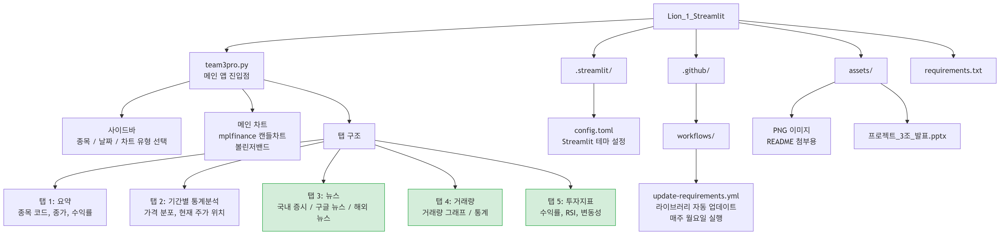

# 주식 차트 분석 서비스 — 상부삼조

> Streamlit 기반 주식 데이터 시각화 웹 애플리케이션


---

## 📌 프로젝트 개요

FinanceDataReader, mplfinance 등을 활용해 종목별 주가 차트를 시각화하고, <br>
차트 하단의 탭 구조를 통해 투자에 필요한 5가지 정보(요약 / 통계 / 뉴스 / 거래량 / 투자지표)를 제공하는 웹 서비스입니다.

- 개발 기간: 2025.12.11 - 2025.12.16
- 구성: 4인 팀 프로젝트

| 이름 | 역할 |
|------|------|
| 공통 | 메인 주식 차트, 사이드바 공통 수정 |
| [김유선](https://github.com/kimyuseon) | 사이드바, 요약 탭, 기간별 통계분석 탭, Lottie |
| [박지영](https://github.com/battlegroundcallofduty) | 구글 뉴스, 국외 뉴스, 거래량 탭, 투자지표 탭, 캐시 |
| [이영진](https://github.com/ilove0628yj-w) | 사이드바 마켓, 국내 증시 뉴스, 볼린저밴드, 범례 |
| [박동제](https://github.com/dongjebag59-dev) | PPT 발표자료, 코드 실행 검증 |

- 배포 환경: Streamlit Community Cloud
- 배포 주소: [https://lion1project3team.streamlit.app/](https://lion1project3team.streamlit.app/)

---

## 🛠 기술 스택

### Language & Framework


### Data & Visualization


### Libraries


### DevOps & Deployment


---

## 🏗 프로젝트 구조



> 초록색 탭(탭 3 일부, 탭 4, 탭 5)은 담당 구현 영역

---

## 🔸 주요 기능


- **왼쪽 사이드바** — 종목, 시작일, 종료일, 차트 유형 및 스타일, 볼린저밴드 여부 선택 후 '확인' 클릭
- **오른쪽 화면** — 사이드바에서 선택한 종목의 주식 차트 시각화 + 하단 5개 탭으로 상세 정보 확인

---

### 탭 1: 요약


종목명, 종목 코드, 최신 종가, 기간 내 최고가/최저가, 선택 기간 수익률을 한눈에 확인할 수 있습니다.

---

### 탭 2: 기간별 통계분석


현재 주가의 기간 내 위치(백분위), 가격 분포(최고/최저/종가/금액 차이)를 표시합니다.

---

### 탭 3: 뉴스


- **국내 증시 뉴스** — Naver Finance 종목 페이지 링크 제공
- **구글 뉴스** ⭐ — Google RSS 파싱을 통해 선택 종목 관련 최신 뉴스 실시간 제공
- **해외 뉴스** ⭐ — Wall Street Journal, Bloomberg, Reuters 링크 제공

---

### 탭 4: 거래량


⭐ mplfinance + st.pyplot 으로 거래량 추이를 시각화하고, <br>
평균 거래량 / 최대 거래량 / 최대 거래량 날짜 / 거래량 수준을 함께 제공합니다.

---

### 탭 5: 투자지표


⭐ 선택 기간 수익률, 연환산 변동성, RSI(상대강도지수), 최근 수익률을 산출하여 투자 참고 지표로 제공합니다.

---

## 👩‍💻 나의 구현 상세

| 기능 | 구현 내용 | 사용 기술 |
|------|----------|-----------|
| 구글 뉴스 | 선택 종목명을 쿼리로 Google News RSS 파싱 → 최신 뉴스 출력 | `requests`, `BeautifulSoup` |
| 국외 뉴스 | WSJ · Bloomberg · Reuters 링크를 탭 내 섹션으로 분류 제공 | `streamlit` |
| 거래량 탭 | mplfinance 막대 그래프 + 요약 통계(평균·최대·수준) | `mplfinance`, `pandas` |
| 투자지표 탭 | 수익률, 연환산 변동성, RSI(14일), 최근 수익률 계산 | `pandas` |
| 캐시 | `@st.cache_data` 적용으로 데이터 중복 요청 방지 및 렌더링 성능 개선 | `streamlit` cache |

### 투자지표 탭 — 계산 방식

**RSI (상대강도지수, 14일)**

`close.diff()`로 일별 등락을 구분한 뒤, `rolling(window=14).mean()`으로 14일 평균 이익(avg_gain)과 평균 손실(avg_loss)을 산출합니다. 이후 `RSI = 100 - 100 / (1 + avg_gain / avg_loss)` 공식을 적용하여 70 이상 과매수 / 30 이하 과매도 구간을 판별합니다.

**연환산 변동성**

`pct_change()`로 일별 수익률을 구한 뒤 `.std() * √252`로 연환산합니다 (연간 거래일 252일 기준). 결과를 퍼센트로 변환해 투자 위험도를 직관적으로 표시합니다.

### 캐시 전략 및 데이터 출처 대응

FinanceDataReader 기반 시세 데이터에는 `@st.cache_data`를 적용하여, **동일 종목·기간 재조회 시 API를 재호출하지 않고 캐시를 반환**합니다. FinanceDataReader는 내부적으로 yfinance를 통해 Yahoo Finance 비공식 API에 접근하므로, 호출 빈도 최소화가 안정적 운영의 핵심이었으며, 캐시가 이를 직접적으로 해결했습니다. 반면 구글 뉴스 RSS에는 `@st.cache_data(ttl=1800)`을 적용해 **30분간 캐시를 유지** 했습니다. 탭 재클릭 시 체감 로딩이 거의 없으며, 뉴스 최신성과 요청 빈도 사이의 균형을 고려해 TTL을 30분으로 지정했습니다.

---

## ▪️ 로컬 실행 방법

```bash
# 1. 레포지토리 클론
git clone https://github.com/battlegroundcallofduty/Lion_1_Streamlit.git
cd Lion_1_Streamlit

# 2. 패키지 설치
pip install -r requirements.txt

# 3. 앱 실행
streamlit run team3pro.py
```

---

## ⚙️ 운영 참고사항

### Streamlit 앱 절전 모드

- Streamlit Community Cloud 무료 플랜은 일정 시간 미접속 시 앱이 잠깁니다. 접속하면 "앱 깨우기" 버튼이 표시되며 1~2분 내 재시작됩니다.

- 상시 유지가 필요한 경우 [UptimeRobot](https://uptimerobot.com) 무료 계정으로 5분 간격 HTTP 모니터를 설정하여 해결 가능합니다.

### 라이브러리 자동 업데이트

`yfinance`, `streamlit-lottie` 등 주요 라이브러리의 업데이트 주기가 잦아, 버전 불일치로 인한 배포 오류가 간헐적으로 발생했습니다. 이를 방지하기 위해 `.github/workflows/update-requirements.yml`에 의해 **매주 월요일** 자동으로 최신 패키지 버전을 확인하고 `requirements.txt`를 갱신합니다. <br>
Streamlit Cloud가 변경을 감지하면 앱을 자동 재배포합니다.

> GitHub Actions 무료 플랜 사용량에 따라 자동화 방식 변경 가능성 있음

---

## 🔹 개발하며 배운 것들

- **캐시 도입**: 팀원이 주식 데이터 로딩 중 페이지가 멈추는 현상을 발견했습니다. 원인을 파악해보니 Streamlit은 버튼 클릭 등 인터랙션마다 스크립트 전체를 재실행하는 구조라, 매번 FinanceDataReader API를 재호출하면서 발생한 문제였습니다. `@st.cache_data`를 적용해 동일 요청은 캐시에서 반환하도록 수정하여 해결했습니다. 팀원의 문제 제기 → 원인 분석 → 직접 해결까지 이어진 과정이 첫 팀 프로젝트에서 가장 인상적인 경험이었습니다.

- **RSS 활용**: 뉴스 기능 구현 중 RSS 피드 개념을 처음 접했고, Google News의 RSS 피드를 파싱해 실시간 뉴스를 뽑아내는 기능을 구현했습니다. 개념을 발견하고 바로 적용해보는 과정이 신선한 경험이었습니다.

```python
@st.cache_data(ttl=1800)
def get_google_news(stock_name, max_news=3):
    query = stock_name.replace(" ", "+")
    url = f"https://news.google.com/rss/search?q={query}+주식&hl=ko&gl=KR&ceid=KR:ko"
    headers = {"User-Agent": "Mozilla/5.0"}
    res = requests.get(url, headers=headers)
    res.raise_for_status()
    soup = BeautifulSoup(res.text, "xml")
    items = soup.find_all("item")[:max_news]

    news_list = []
    for item in items:
        title = item.title.text
        link = item.link.text
        pub_date = item.pubDate.text

        news_list.append({
            "title": title,
            "link": link,
            "date": pub_date})
    return news_list
```

**도메인 지식의 필요성**

주식에 대한 사전 지식이 전혀 없는 상태에서 개발을 시작했습니다. RSI, 볼린저밴드, 연환산 변동성 같은 개념은 구현 과정에서 처음 접했고, 자료와 개념을 찾아가며 최대한 이해하려 노력했습니다. 수식을 코드로 옮기긴 했지만, 투자자 입장에서 이 수치가 실제로 어떤 의미인지는 아직 완전히 와닿지 않습니다. 도메인 지식 없이 기능을 구현해본 경험을 통해, 코드 이상으로 해당 분야를 이해하는 것의 중요성을 느꼈습니다.

---

## 🔹 추후 개선 사항

- 첫 팀 프로젝트로 에러 방지, 코드 효율화에 대한 고민이 부족했던 부분 → 리팩토링 예정
- 타겟 사용자 명확화 필요: 주식 초보자 대상 설명 강화 vs 투자자 대상 전문 정보 확대
- Streamlit 추가 컴포넌트(st.columns, st.metric 등) 활용한 UI 개선 검토
- 하단 탭 UI를 보다 직관적인 레이아웃으로 개편 예정
- WSJ · Bloomberg · Reuters도 단순 url이 아니라 RSS/API 연동으로 실시간 뉴스 파싱 구현

