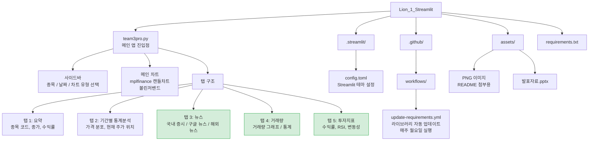

# 주식 차트 분석 서비스 — 상부삼조

> Streamlit 기반 주식 데이터 시각화 웹 애플리케이션


---

## 📌 프로젝트 개요

yfinance, mplfinance 등을 활용해 종목별 주가 차트를 시각화하고, <br>
차트 하단의 탭 구조를 통해 투자에 필요한 5가지 정보(요약 / 통계 / 뉴스 / 거래량 / 투자지표)를 제공하는 웹 서비스입니다.

- 개발 기간: 2025.12.11 ~ 2025.12.16
- 구성: 4인 팀 프로젝트

| 이름 | 역할 |
|------|------|
| 공통 | 메인 주식 차트, 사이드바 공통 수정 |
| [김유선](https://github.com/kimyuseon) | 사이드바, 요약 탭, 기간별 통계분석 탭, Lottie 애니메이션 |
| [박지영](https://github.com/battlegroundcallofduty) | 구글 뉴스, 국외 뉴스, 거래량 탭, 투자지표 탭, 캐시 |
| [이영진](https://github.com/ilove0628yj-w) | 사이드바 마켓, 국내 증시 뉴스, 볼린저밴드, 범례 |
| [박동제](https://github.com/dongjebag59-dev) | PPT 발표자료, 코드 실행 검증 |

- 배포 환경: Streamlit Community Cloud
- 배포 주소: [https://lion1project3team.streamlit.app/](https://lion1project3team.streamlit.app/)

---

## 🛠 기술 스택

### Language & Framework


### Data & Visualization


### Libraries


### DevOps & Deployment


---

## 🏗 프로젝트 구조



> 초록색 탭(탭 3 일부, 탭 4, 탭 5)은 담당 구현 영역

---

## 🔸 주요 기능


- **왼쪽 사이드바** — 종목, 시작일, 종료일, 차트 유형 및 스타일, 볼린저밴드 여부 선택 후 '확인' 클릭
- **오른쪽 화면** — 사이드바에서 선택한 종목의 주식 차트 시각화 + 하단 5개 탭으로 상세 정보 확인

---

### 탭 1: 요약


종목명, 종목 코드, 최신 종가, 기간 내 최고가/최저가, 선택 기간 수익률을 한눈에 확인할 수 있습니다.

---

### 탭 2: 기간별 통계분석


현재 주가의 기간 내 위치(백분위), 가격 분포(최고/최저/종가/금액 차이)를 시각화합니다.

---

### 탭 3: 뉴스


- **국내 증시 뉴스** — finance-datareader 기반 국내 뉴스 크롤링
- **구글 뉴스** ⭐ — Google RSS 파싱을 통해 선택 종목 관련 최신 뉴스 실시간 제공
- **해외 뉴스** ⭐ — Wall Street Journal, Bloomberg, Reuters RSS 파싱

---

### 탭 4: 거래량


⭐ Plotly 인터랙티브 그래프로 거래량 추이를 시각화하고, <br>
평균 거래량 / 최대 거래량 / 최대 거래량 날짜 / 거래량 수준을 함께 제공합니다.

---

### 탭 5: 투자지표


⭐ 선택 기간 수익률, 연환산 변동성, RSI(상대강도지수), 최근 수익률을 산출하여 투자 참고 지표로 제공합니다.

---

## 👩‍💻 나의 구현 상세

| 기능 | 구현 내용 | 사용 기술 |
|------|----------|-----------|
| 구글 뉴스 | 선택 종목명을 쿼리로 Google News RSS 파싱 → 최신 뉴스 카드 출력 | `requests`, `BeautifulSoup`, `feedparser` |
| 국외 뉴스 | WSJ · Bloomberg · Reuters RSS를 파싱하여 탭 내 섹션 분류 출력 | `requests`, `BeautifulSoup` |
| 거래량 탭 | Plotly 막대 그래프 + 요약 통계(평균·최대·수준) | `plotly`, `pandas` |
| 투자지표 탭 | 수익률, 연환산 변동성, RSI(14일), 최근 수익률 계산 및 시각화 | `pandas`, `numpy`, `plotly` |
| 캐시 | `@st.cache_data` 적용으로 데이터 중복 요청 방지 및 렌더링 성능 개선 | `streamlit` cache |

---

## ▪️ 로컬 실행 방법

```bash
# 1. 레포지토리 클론
git clone https://github.com/battlegroundcallofduty/Lion_1_Streamlit.git
cd Lion_1_Streamlit

# 2. 패키지 설치
pip install -r requirements.txt

# 3. 앱 실행
streamlit run team3pro.py
```

---

## ⚙️ 운영 참고사항

### Streamlit 앱 절전 모드

- Streamlit Community Cloud 무료 플랜은 일정 시간 미접속 시 앱이 잠깁니다. 접속하면 "앱 깨우기" 버튼이 표시되며 1~2분 내 재시작됩니다.

- 상시 유지가 필요한 경우 [UptimeRobot](https://uptimerobot.com) 무료 계정으로 5분 간격 HTTP 모니터를 설정하여 해결 가능합니다.

### 라이브러리 자동 업데이트

`yfinance`, `streamlit-lottie` 등 주요 라이브러리의 업데이트 주기가 잦아, 버전 불일치로 인한 배포 오류가 간헐적으로 발생했습니다. <br>
이를 방지하기 위해 `.github/workflows/update-requirements.yml`에 의해 **매주 월요일** 자동으로 최신 패키지 버전을 확인하고 <br>
`requirements.txt`를 갱신합니다. Streamlit Cloud가 변경을 감지하면 앱을 자동 재배포합니다.

> GitHub Actions 무료 플랜 사용량에 따라 자동화 방식 변경 가능성 있음

---

## 🔹 회고 및 개선 방향

- 첫 팀 프로젝트로 에러 방지, 코드 효율화에 대한 고민이 부족했던 부분 → 리팩토링 예정
- 타겟 사용자 명확화 필요: 주식 초보자 대상 설명 강화 vs 투자자 대상 전문 정보 확대
- Streamlit 추가 컴포넌트(st.columns, st.metric 등) 활용한 UI 개선 검토
- 하단 탭 UI를 보다 직관적인 레이아웃으로 개편 예정
